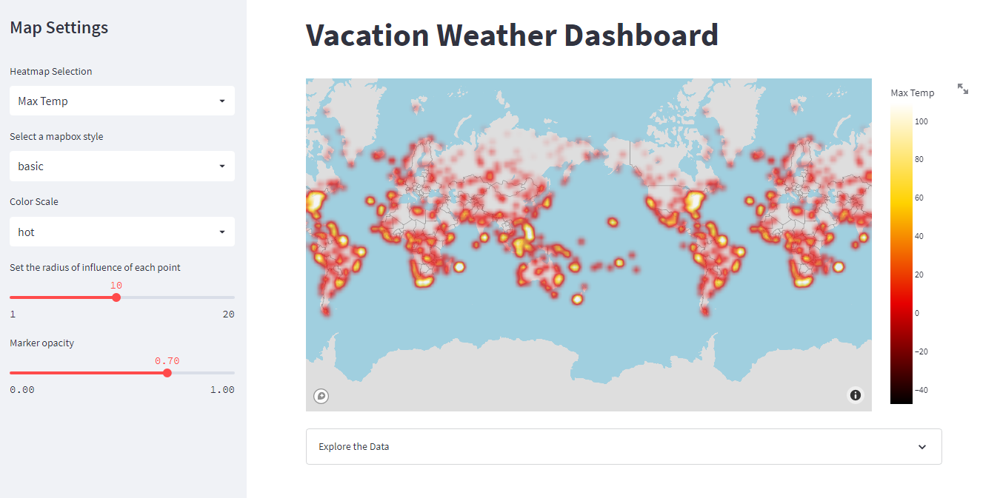

# Vacation-Weather-Dashboard

## Dashboard

[Click here to view the live Dashboard!](https://matin-n-vacation-weather-dashboard-streamlit-app-k4h6j7.streamlitapp.com/)

## Purpose

This project constructs an interactive dashboard to implement data visualizations for varying weather conditions (temperature, humidity, wind speed, and cloudiness).

The dataset comes from [World Weather Analysis](https://github.com/matin-n/World-Weather-Analysis). The weather data is archived from December 2, 2021. The original data was obtained from [OpenWeatherMap API](https://openweathermap.org/api), and the city locations were obtained from the [MaxMind World Cities Database](http://www.maxmind.com/en/free-world-cities-database) using the [CitiPy](https://github.com/wingchen/citipy) library. View the original [World Weather Analysis](https://github.com/matin-n/World-Weather-Analysis) repository for more information on how the data was collected and parsed.

- Data visualizations that are attractive, accessible, and interactive
- Interactive features such as dropdowns, sliders, and hover data
- Deploy an interactive dashboard with Streamlit

## Resources

- Data Source: [`cities.csv`](cities.csv)
- Libraries: [`Pandas`](https://pandas.pydata.org/), [`Plotly`](https://plotly.com/graphing-libraries/), [`Streamlit`](https://streamlit.io/), [`StatsModels`](https://www.statsmodels.org/stable/index.html)
- Additional: [Mapbox](https://www.mapbox.com/), [OpenWeatherMap](https://openweathermap.org/api)
- Source Code: [`streamlit_app.py`](streamlit_app.py)
